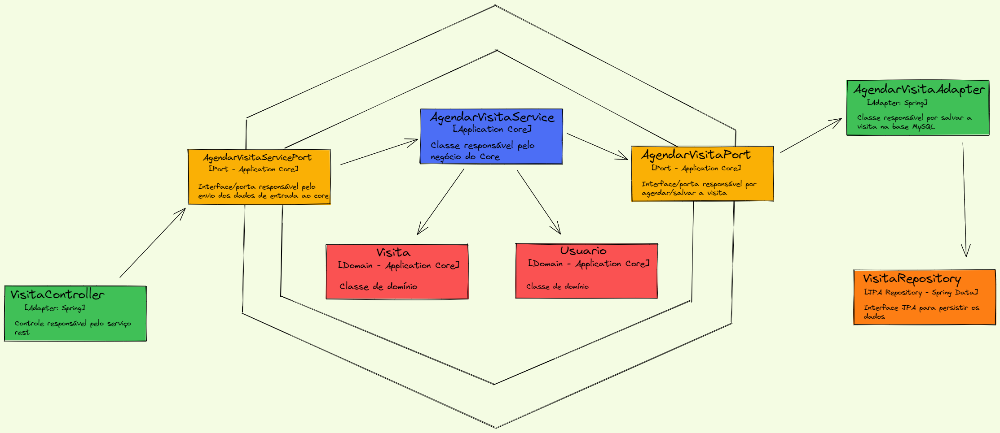

# Exemplo de Arquitetura Hexagonal em Java

Projeto realizado para exemplificar a utilização da arquitetura hexagonal dentro do contexto do java, utilizando o 
spring, podendo ter sido realizado com qualquer outro framework.

## Arquitetura do projeto

Abaixo segue uma imagem da arquitetura do projeto em uma visão macro de componentes:


### Passo a passo para executar o projeto localmente

1. Execute o comando abaixo dentro do diretório docker, localizado na raíz do projeto.
````shell script
docker-compose up
````
Esse comando criará e executará um container para a subida do MySQL.

2. Com o container up, basta executar o comando abaixo em sua IDE ou linha de comando.
````shell script
mvn spring-boot:run
````

3. Exemplo de chamada para ser executada:
````shell script
curl --location --request POST 'http://localhost:8002/agendar-visita' \
--header 'Content-Type: application/json' \
--data-raw '{
    "data":"2022-04-22",
    "horario":"22:40",
    "usuario": {
        "cpf":"12345678909",
        "nome":"Usuario Teste",
        "email":"teste@teste.com.br"
    }
}'
````